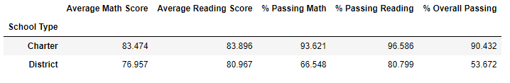
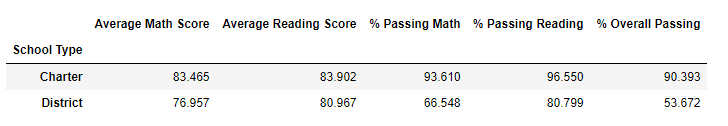

# School_District_Analysis

## Project Overview

This project is to peform the school district analysis by excluding the math and reading scores for Thomas High School ninth grade that has been reported to have altered grades.

The project will replace all the reading and math grades for nine grades in Thomas School by NaN and repeat the analysis for school distric to find the impact. 

## Results:

- The District summary for all 15 schools was affcted as the math and reading scores of 461 students in grade 9 in Thomas High school were removed (replaced by NaN).The total average math had a decrease and reading score had an increase of less than 1%.
      
- The math score in Thomas school had a decrease but the reading score increased in Thomas High school compared to other schools. Since the aveages for math and reading has been up after removing the scores for grade nine shows those scores for grade nine might have been low.

- replacing the ninth-grade scores affect the following :

    - Math scores decreased and reading scores increased which means the math score for 9th grade were higher and reading scores for them were lower.
    - There were only changes in spending range of $630-$644 schools.The math scores had a decrease and the reading scores had an increase of less than 1%
    - We only saw changes on math and reading scores in medium size schools. math score had a decrease and reading had an increase. 
    - There was no change in District type schools as Thomas high school was a charter type. The math scores in charter schools had again a decrease and reading had an increase by less than 1%
    
    ** The District Summary after replacing scores for great nine at Thomas School **
    
    
    
     ** The District Summary for all Schools **
    
     
    
    
## Summary :
- We changed the student_data_df by replacing math and reading scores of ninth grade in Thomas school by NaN which was assigned by np.nan from Numpy library
- We calculated a new count for students as 461 belonged to grade nine at Thomas school
- We recaluculated the avearge of math , reading and % passing scores for math, reading and both
- we used loc function to retrieve records from data frame using multiple conditions

  
